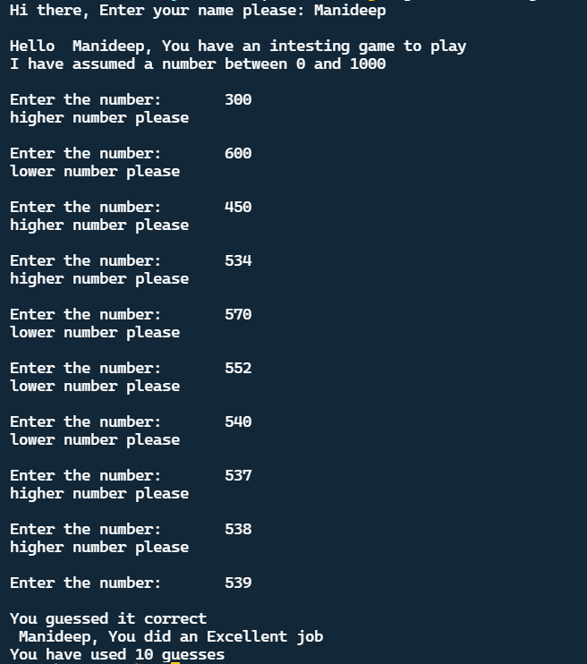

## Guess The Number
This game is developed using C Programming using srand function and some user inputs.

### About the game
- It's a basic C program which generates a random number and asks the user to guess.
- It iterates over loop till the generated number matches user input.

### How to play?
- Just run the program and enter numbers between 0 and 1000.
- As you guess the number correct, you won.

### Setup Instructions
1. <a href="https://code.visualstudio.com/Download"> Install VS Code</a> (recommended) from here.
2. Or else you can use your favourite IDE.
3. Download this repository as zip and extract.
4. Run the code and start guessing numbers.
5. Have fun :)

### Output

